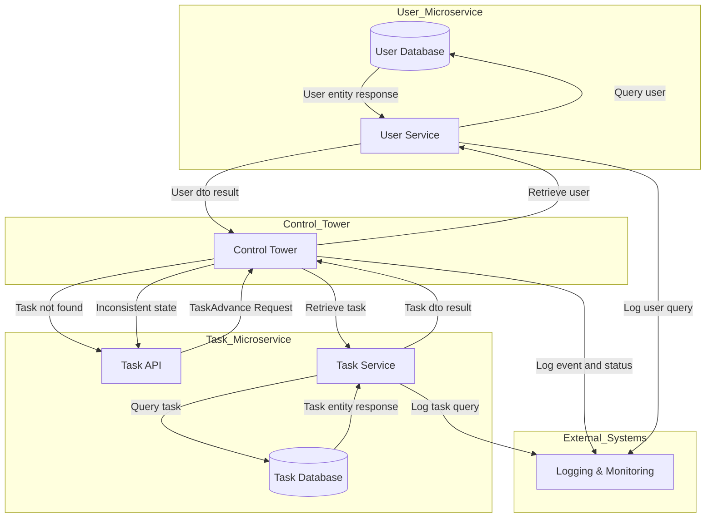

```mermaid
flowchart TD
  %% User Microservice components
  subgraph User_Microservice
    %% Stores user data
    UDB[(User Database)]
    %% Business logic for user operations
    UService[User Service]
  end

  %% Task Microservice components
  subgraph Task_Microservice
  %% Entry point for user-related requests
    TAPI[Task API]
    %% Stores task data
    TDB[(Task Database)]
    %% Business logic for task operations
    TService[Task Service]
  end

  %% Control Tower component
  subgraph Control_Tower
    %% Orchestrates cross-service workflows
    CT[Control Tower]
  end

  %% External systems for logging and monitoring
  subgraph External_Systems
    %% Centralized logging and monitoring
    Logger[Logging & Monitoring]
  end

  %% Flow of TaskAdvance request
  TAPI -- TaskAdvance Request --> CT

  %% Control Tower checks if task exists via Task Service
  CT -- Retrieve task --> TService
  TService -- Query task --> TDB
  TDB -- Task entity response --> TService
  TService -- Task dto result --> CT

  %% Control Tower returns error to Task API if task is missing
  CT -- Task not found --> TAPI

  %% Control Tower verifies assignee existence with User Service
  CT -- Retrieve user --> UService
  UService -- Query user --> UDB
  UDB -- User entity response --> UService
  UService -- User dto result --> CT

  %% Control Tower returns error to Task API if user is missing
  CT -- Inconsistent state --> TAPI

  %% Logging events and status updates
  CT -- Log event and status --> Logger
  TService -- Log task query --> Logger
  UService -- Log user query --> Logger
```
