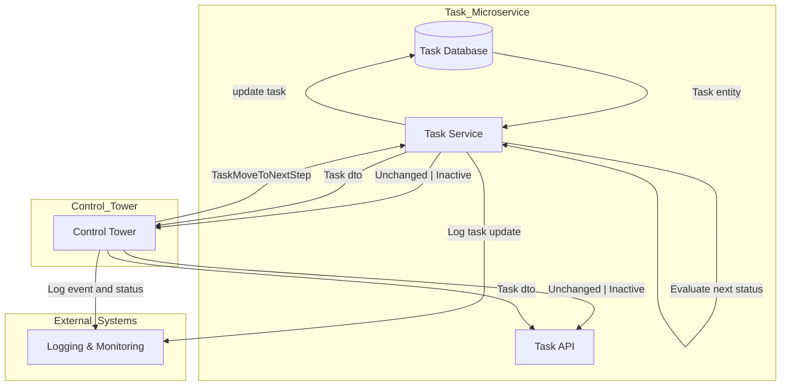

```mermaid
flowchart TD
  %% Task Microservice components
  subgraph Task_Microservice
  %% Entry point for user-related requests
    TAPI[Task API]
    %% Stores task data
    TDB[(Task Database)]
    %% Business logic for task operations
    TService[Task Service]
  end

  %% Control Tower component
  subgraph Control_Tower
    %% Orchestrates cross-service workflows
    CT[Control Tower]
  end

  %% External systems for logging and monitoring
  subgraph External_Systems
    %% Centralized logging and monitoring
    Logger[Logging & Monitoring]
  end

  %% La Control Tower richiede al Task Service di avanzare lo stato
  CT -- TaskMoveToNextStep --> TService

  %% Il Task Service calcola lo stato successivo e segnala gli errori
  %% Unchanged se stato di partenza e calcolato corrispondono a DONE e non servono salvataggi
  %% Inactive se si cerca di mettere IN PROGRESS o IN REVIEW un utente non ACTIVE
  TService -- Evaluate next status --> TService
  TService -- Unchanged | Inactive --> CT
  CT -- Unchanged | Inactive --> TAPI

  %% Il Task Service esegue l'aggiornamento del task attraverso il Task DB
  TService -- update task --> TDB
  TDB -- Task entity --> TService
  TService -- Task dto --> CT
  CT -- Task dto --> TAPI

  %% Logging events and status updates
  CT -- Log event and status --> Logger
  TService -- Log task update --> Logger
```
