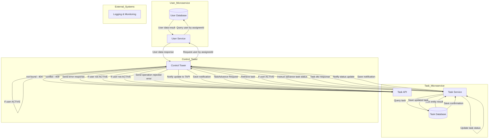

```mermaid
flowchart TD
  %% User Microservice components
  subgraph User_Microservice
    %% Stores user data
    UDB[(User Database)]
    %% Business logic for user operations
    UService[User Service]
  end

  %% Task Microservice components
  subgraph Task_Microservice
  %% Entry point for user-related requests
    TAPI[Task API]
    %% Stores task data
    TDB[(Task Database)]
    %% Business logic for task operations
    TService[Task Service]
  end

  %% Control Tower component
  subgraph Control_Tower
    %% Orchestrates cross-service workflows
    CT[Control Tower]
  end

  %% External systems for logging and monitoring
  subgraph External_Systems
    %% Centralized logging and monitoring
    Logger[Logging & Monitoring]
  end

  %% Flow of TaskAdvance request
  %% GET /api/tasks/{id}/advance
  TAPI -- TaskAdvance Request --> CT

  %% Control Tower checks if task exists via Task Service
  CT -- Retrieve task --> TService
  TService -- Query task --> TDB
  TDB -- Task entity result --> TService
  TService -- Task dto response --> CT

  %% Control Tower returns a not found result if missing
  CT -- not found - 404 --> TAPI

  %% Control Tower verifies that the task has an assignee
  CT -- Check assigneeId presence --> CT

  %% If unassigned, block the process
  CT -- conflict - 409 --> TAPI
  
  %% Control Tower requests up-to-date user by assigneeId from UService
  CT -- Request user by assigneeId --> UService

  %% UService queries UDB for updated user and returns it to CT
  UService -- Query user by assigneeId --> UDB
  UDB -- User data result --> UService
  UService -- User data response --> CT


  %% Control Tower prevents operation to continue if task is IN_PROGRESS or IN_REVIEW and user not ACTIVE
  %% In this case, Control Tower sends appropriate error to TAPI: operation rejected or inconsistent data
  CT -- Send error response --> TAPI

  
  %% Control Tower verifies that the user is ACTIVE
  CT -- Check if user status ACTIVE --> CT

  %% CT loops on itself
  CT -- If user ACTIVE --> CT
  CT -- If user not ACTIVE --> TAPI

  %% Control Tower options based on assignee status
  CT -- If user ACTIVE --> TService
  CT -- If user not ACTIVE --> TAPI

  %% CT instructs TService to advance the task status
  CT -- Instruct advance task status --> TService

  %% CT sends operation rejected error to TAPI
  CT -- Send operation rejected error --> TAPI

  %% Task Service calculates the next status
  TService -- Calculate next status --> TService

  %% If evaluated is DONE and task was already DONE, result code is SUCCESS but signals no change
  %% Otherwise, updates the task with the calculated next status
  TService -- Update task status --> TService
  TService -- Notify status update --> CT
  CT -- Notify update to TAPI --> TAPI

  %% Task Service saves the updated task via the database
  TService -- Save updated task --> TDB
  TDB -- Save confirmation --> TService

  %% Save notification reaches TAPI through TService and CT
  TService -- Save notification --> CT
  CT -- Save notification --> TAPI
```