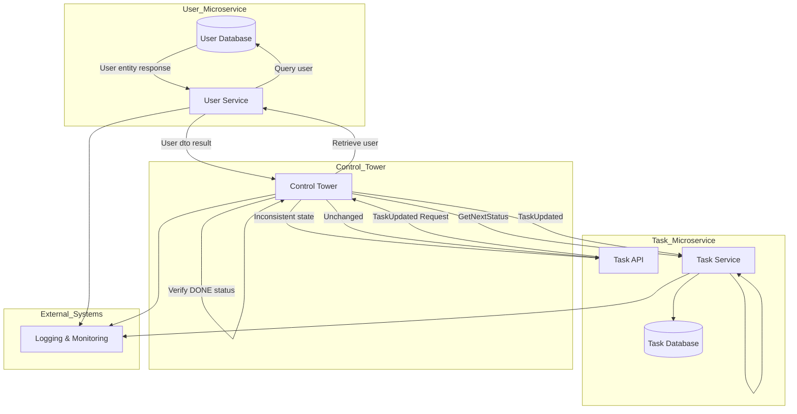

```mermaid
flowchart TD
  %% User Microservice components
  subgraph User_Microservice
    %% Stores user data
    UDB[(User Database)]
    %% Business logic for user operations
    UService[User Service]
  end

  %% Task Microservice components
  subgraph Task_Microservice
  %% Entry point for user-related requests
    TAPI[Task API]
    %% Stores task data
    TDB[(Task Database)]
    %% Business logic for task operations
    TService[Task Service]
  end

  %% Control Tower component
  subgraph Control_Tower
    %% Orchestrates cross-service workflows
    CT[Control Tower]
  end

  %% External systems for logging and monitoring
  subgraph External_Systems
    %% Centralized logging and monitoring
    Logger[Logging & Monitoring]
  end

  %% Flow of TaskUpdated request
  TAPI -- TaskUpdated Request --> CT

  %% Control Tower verifies assignee existence with User Service
  CT -- Retrieve user --> UService
  UService -- Query user --> UDB
  UDB -- User entity response --> UService
  UService -- User dto result --> CT

  %% Control Tower returns error to Task API if user is missing
  CT -- Inconsistent state --> TAPI

  %% La Control Tower si fa generare dal Task Service lo stato successivo
  CT -- GetNextStatus --> TService

  %% La Control Tower restituisce alla Task API Unchanged se eil task era già DONE
  CT -- Verify DONE status --> CT
  CT -- Unchanged --> TAPI

  %% La Control Tower affida la richiesta al Task Service 
  CT -- TaskUpdated --> TService
  TService --> TDB
  TService --> TService


  CT --> Logger
  TService --> Logger
  UService --> Logger
```
