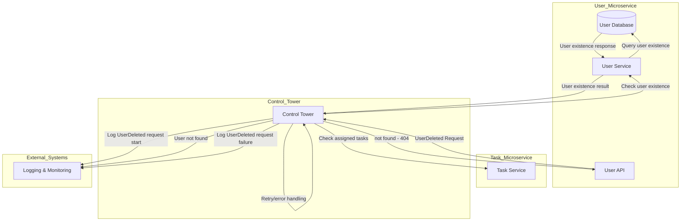

```mermaid
flowchart TD
  %% User Microservice components
  subgraph User_Microservice
    %% Stores user data
    UDB[(User Database)]
    %% Entry point for user-related requests
    UAPI[User API]
    %% Business logic for user operations
    UService[User Service]
  end
  %% Task Microservice components
  subgraph Task_Microservice
    %% Business logic for task operations
    TService[Task Service]
  end
  %% Control Tower component
  subgraph Control_Tower
    %% Orchestrates cross-service workflows
    CT[Control Tower]
  end
  %% External systems for logging and monitoring
  subgraph External_Systems
    %% Centralized logging and monitoring
    Logger[Logging & Monitoring]
  end

  %% Flow of UserDeleted request
  UAPI -- UserDeleted Request --> CT
  CT -- Log UserDeleted request start --> Logger

  %% Control Tower checks if user exists via User Service
  CT -- Check user existence --> UService
  UService -- Query user existence --> UDB
  UDB -- User existence response --> UService
  UService -- User existence result --> CT
  CT -- Retry/error handling --> CT
  
  %% Control Tower ends flow with missing user
  CT -- User not found --> Logger
  CT -- Log UserDeleted request failure --> Logger
  CT -- not found - 404 --> UAPI

  %% The user to delete must not have any assigned task
  CT -- Check assigned tasks --> TService
```