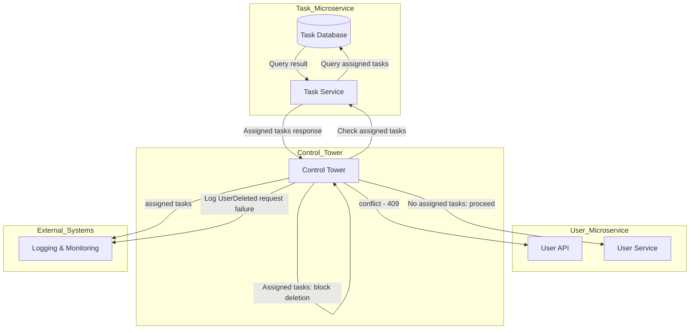

```mermaid
flowchart TD
  %% User Microservice components
  subgraph User_Microservice
    %% Entry point for user-related requests
    UAPI[User API]
    %% Business logic for user operations
    UService[User Service]
  end
  %% Task Microservice components
  subgraph Task_Microservice
    %% Stores task data
    TDB[(Task Database)]
    %% Business logic for task operations
    TService[Task Service]
  end
  %% Control Tower component
  subgraph Control_Tower
    %% Orchestrates cross-service workflows
    CT[Control Tower]
  end
  %% External systems for logging and monitoring
  subgraph External_Systems
    %% Centralized logging and monitoring
    Logger[Logging & Monitoring]
  end

  %% The user to delete must not have any assigned task
  CT -- Check assigned tasks --> TService

  %% Task Service queries assigned tasks
  TService -- Query assigned tasks --> TDB
  TDB -- Query result --> TService
  TService -- Assigned tasks response --> CT

  %% In case of errors, retries three times
  %% Logs every attempt after the first
  %% On third failure, returns a 500 to UAPI
  CT -- Retry/error handling --> CT

  %% Control Tower branches based on assigned tasks
  CT -- No assigned tasks: proceed --> UService
  CT -- Assigned tasks: block deletion --> CT

  %% Control Tower blocks deletion and sends error notification
  CT -- assigned tasks --> Logger
  CT -- Log UserDeleted request failure --> Logger
  CT -- conflict - 409 --> UAPI
```