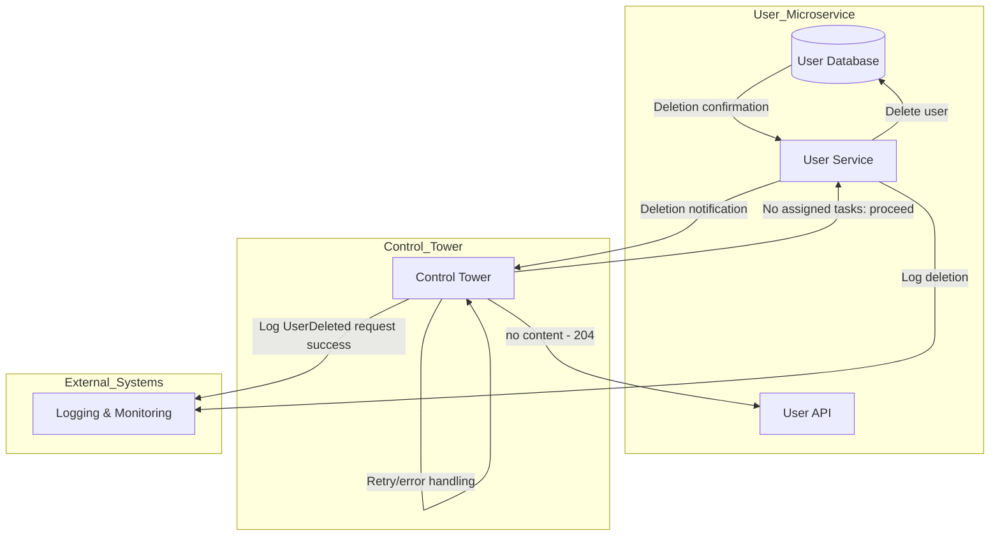

```mermaid
flowchart TD
  %% User Microservice components
  subgraph User_Microservice
    %% Stores user data
    UDB[(User Database)]
    %% Entry point for user-related requests
    UAPI[User API]
    %% Business logic for user operations
    UService[User Service]
  end
  %% Control Tower component
  subgraph Control_Tower
    %% Orchestrates cross-service workflows
    CT[Control Tower]
  end
  %% External systems for logging and monitoring
  subgraph External_Systems
    %% Centralized logging and monitoring
    Logger[Logging & Monitoring]
  end
   
  %% Control Tower allows user deletion
  CT -- No assigned tasks: proceed --> UService

  %% User Service deletes user
  UService -- Delete user --> UDB
  UDB -- Deletion confirmation --> UService
  UService -- Log deletion --> Logger
  UService -- Deletion notification --> CT

  %% In case of errors, retries three times
  %% Logs every attempt after the first
  %% On third failure, returns a 500 to UAPI
  CT -- Retry/error handling --> CT

  %% Notify User API of successful deletion
  CT -- Log UserDeleted request success --> Logger
  CT -- no content - 204 --> UAPI
```