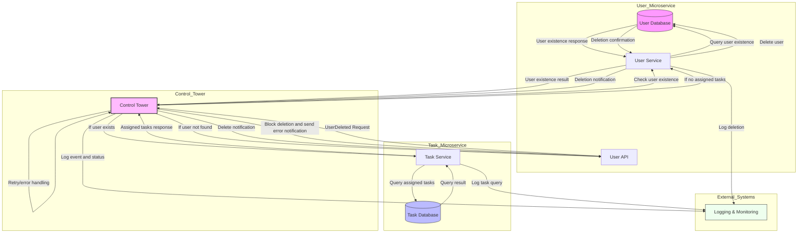

```mermaid
flowchart TD
  %% User Microservice components
  subgraph User_Microservice
    %% Stores user data
    UDB[(User Database)]
    %% Entry point for user-related requests
    UAPI[User API]
    %% Business logic for user operations
    UService[User Service]
  end

  %% Task Microservice components
  subgraph Task_Microservice
    %% Stores task data
    TDB[(Task Database)]
    %% Business logic for task operations
    TService[Task Service]
  end

  %% Control Tower component
  subgraph Control_Tower
    %% Orchestrates cross-service workflows
    CT[Control Tower]
  end

  %% External systems for logging and monitoring
  subgraph External_Systems
    %% Centralized logging and monitoring
    Logger[Logging & Monitoring]
  end

  %% Flow of UserDeleted request
  UAPI -- UserDeleted Request --> CT

  %% Control Tower checks if user exists via User Service
  CT -- Check user existence --> UService
  UService -- Query user existence --> UDB
  UDB -- User existence response --> UService
  UService -- User existence result --> CT

  %% Control Tower branches based on user existence
  CT -- If user exists --> TService
  CT -- If user not found --> UAPI

  %% Task Service queries assigned tasks
  TService -- Query assigned tasks --> TDB
  TDB -- Query result --> TService
  TService -- Assigned tasks response --> CT

  %% Control Tower branches based on assigned tasks
  CT -- If no assigned tasks --> UService
  CT -- If assigned tasks --> CT

  %% User Service deletes user
  UService -- Delete user --> UDB
  UDB -- Deletion confirmation --> UService
  UService -- Deletion notification --> CT
  CT -- Delete notification --> UAPI

  %% Control Tower blocks deletion and sends error notification
  CT -- Block deletion and send error notification --> UAPI

  %% Logging and monitoring
  CT -- Log event and status --> Logger
  UService -- Log deletion --> Logger
  TService -- Log task query --> Logger
  CT -- Retry/error handling --> CT

  %% Styling for clarity
  style UDB fill:#f9f,stroke:#333,stroke-width:1px
  style TDB fill:#bbf,stroke:#333,stroke-width:1px
  style CT fill:#fbf,stroke:#333,stroke-width:2px
  style Logger fill:#efe,stroke:#333,stroke-width:1px
```
